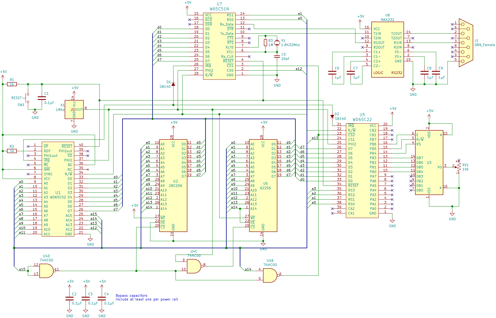
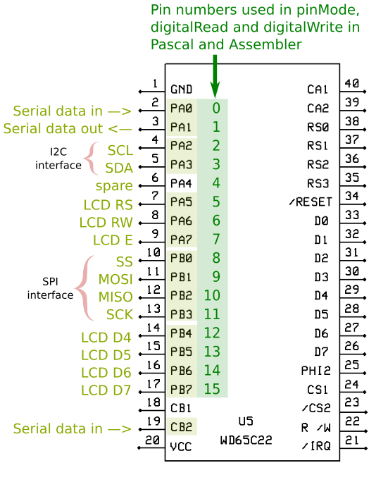

# W65C02_Board
Ben Eater board with Nick's G-Pascal Compiler


Press the green NMI button on start-up
```console
G-Pascal compiler, version 4.07.
Written by Nick Gammon.
Type H for help.
:
```
---

## Features :

- W65C02 microcontroller with Nick Gammon G-Pascal ROM ;
- 32 KiB EPROM for G-Pascal ;
- 28 KiB RAM ;
- Integrated VIA 6522 ;
- ORIC-1 compatible expansion connector ;
- Address decoding with a GAL22V10 ;
- USB serial interface with FTDI232 module ;
- Gerber file available.


- The GAL JED file is generated using the utility [GALasm](https://github.com/daveho/GALasm) under linux.
- The programmer used is a [XGECU - pro](https://www.aliexpress.com/premium/XGecu.html)
- It is capable of programming E(E)PROMs, and Lattice GAL22V10.
---

## ROM Configutration :

In gpascal.asm HIGHEST_RAM is $6FFF,

gpascal_0x6fff.bin was generated for the 27c256 EPROM

```console
;
;  CONFIGURATION
;
CLOCK_RATE   = 1000000   ; 1 Mhz
START_OF_ROM = $8000     ; where the ROM chip starts
HIGHEST_RAM  = $6FFF    ; with GAL22V10
```
---
## Peripheral Address :

| Peripheral | start address | end address |
| ------ | ------ | ------ |
| RAM | #0000 | #6FFF |
| EPROM (27C256) | #8000 | #FFFF |
| VIA | #7FF0 | #7FFF |
| IO1 | #7FE0 | #7FEF |
| IO2 | #7FD0 | #7FDF |
| IO3 | #7FC0 | #7FCF |
| IO4 | #7FB0 | #7FBF |

---
## hardware


# Original Schematics



# Dedicated ports on the via 6522



---
# Schematics with Nick's modifications


- Beware : with old via MOS6522 R4=100 ohms

---
## Few programs examples (4800 bauds 1MHz clock)

[Interactive demo](demo/README.md)
---
## CPU straps :

For W65C02 microcontroller :
- J7  : open
- J11 : short
- J2  : open
- J3  : short

For MOS 6502 microcontroller (No compatibility with G-Pascal ROM):
- J7  : short
- J11 : open
- J2  : short
- J3  : open
---
## Usefull links

- Nickgammon G-Pascal [main page](http://www.gammon.com.au/G-Pascal/index.htm)

- Nickgammon G-Pascal [github](https://github.com/nickgammon/G-Pascal/tree/master)

- Nickgammon G-Pascal [info](http://www.gammon.com.au/G-Pascal/pascal_compiler.htm)

- Nickgammon ASM [info](http://www.gammon.com.au/G-Pascal/assembler.htm)

- Ben Eater [Build a 6502 computer](https://eater.net/)

- Build your [own ORIC ATMOS](https://github.com/f4goh/oric/tree/main/Oric1-Atmos)

---
```console
G-Pascal compiler, version 4.07.
Written by Nick Gammon.
Type H for help.
: h

Available actions:

Delete      line_number_range
Insert/LOad after_line
Find        line_number_range /target/flags
List/SAve   line_number_range
Replace     line_number_range /target/replacement/flags
RECover
---
Help
INFo
Memory      first_address last_address
Assemble
Compile/Syntax
DEBug/Trace
LIBrary
Poke/Jsr/JMp
RUn
RESume
(Actions may be abbreviated)
(Flags: 'I'gnore case, 'G'lobal, 'Q'uiet)
:
```


