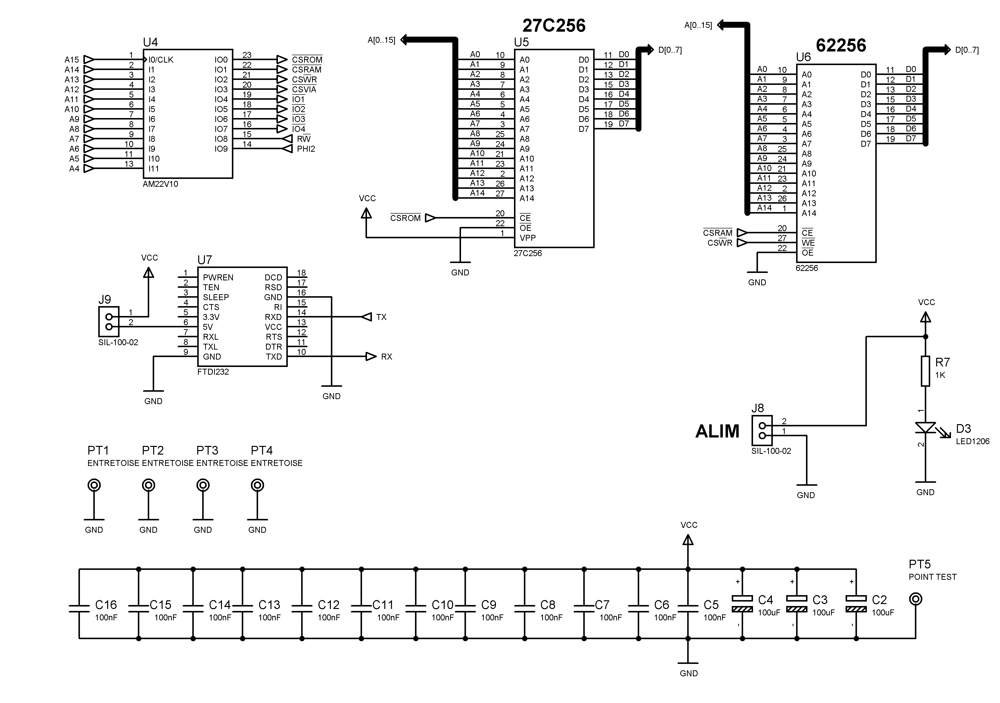

# W65C02_Board
Ben Eater board with Nick's G-Pascal Compiler


```console
G-Pascal compiler, version 4.07.
Written by Nick Gammon.
Type H for help.
:
```


## Features :

- W65C02 microcontroller with Nick Gammon G-Pascal ROM ;
- 32 KiB EPROM for G-Pascal ;
- 28 KiB RAM ;
- Integrated VIA 6522 ;
- ORIC-1 compatible expansion connector;
- Address decoding with a GAL22V10;
- USB serial interface with FTDI232 module.
- Gerber file available


- The GAL JED file is generated using the utility [GALasm](https://github.com/daveho/GALasm) under linux.
- the programmer used is a [XGECU - pro](https://www.aliexpress.com/premium/XGecu.html)
- It is capable of programming AT89S52, E(E)PROMs, and Lattice GAL22V10.

## Peripheral Address :

| Peripheral | start address | end address |
| ------ | ------ | ------ |
| RAM | #0000 | #6FFF |
| EPROM (27C256) | #8000 | #FFFF |
| EEPROM (28C64) | #8000 | #9FFF |
| VIA | #7FF0 | #7FFF |
| IO1 | #7FE0 | #7FEF |
| IO2 | #7FD0 | #7FDF |
| IO3 | #7FC0 | #7FCF |
| IO4 | #7FB0 | #7FBF |


## hardware





## Some sample programmes (autobaud, but test with 9600 bauds)

[interactive demo](demo/README.md)

## Usefull links

- Nickgammon [nickgammon](https://github.com/nickgammon/G-Pascal/tree/master)

- Ben Eater [eater](https://eater.net/)

```console
G-Pascal compiler, version 4.07.
Written by Nick Gammon.
Type H for help.
: h

Available actions:

Delete      line_number_range
Insert/LOad after_line
Find        line_number_range /target/flags
List/SAve   line_number_range
Replace     line_number_range /target/replacement/flags
RECover
---
Help
INFo
Memory      first_address last_address
Assemble
Compile/Syntax
DEBug/Trace
LIBrary
Poke/Jsr/JMp
RUn
RESume
(Actions may be abbreviated)
(Flags: 'I'gnore case, 'G'lobal, 'Q'uiet)
:
```


