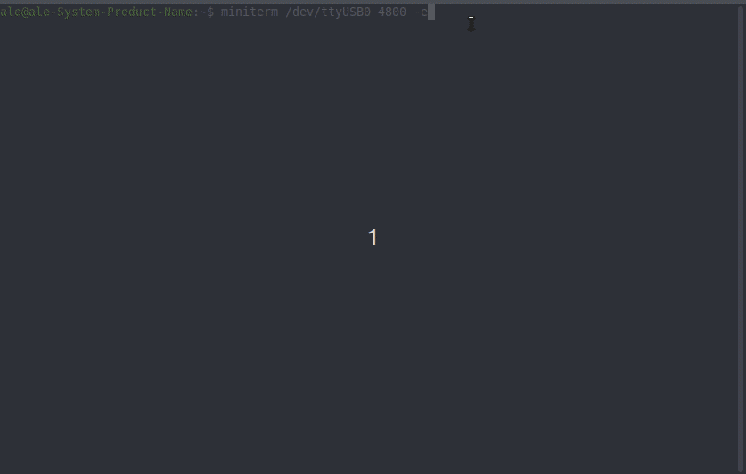
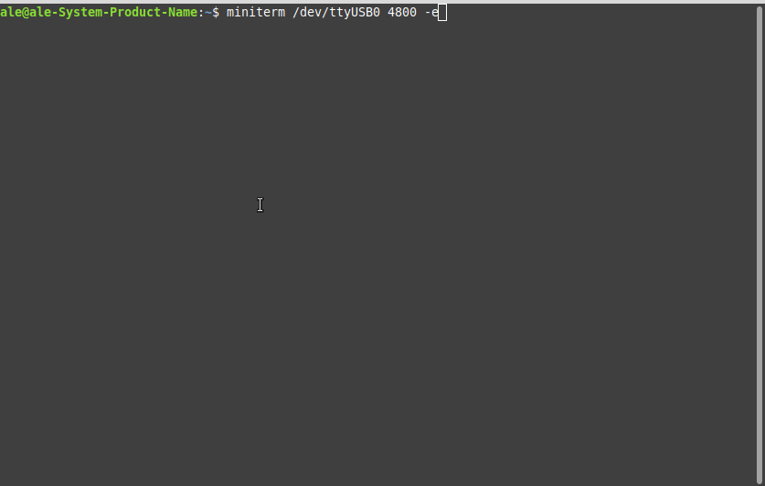
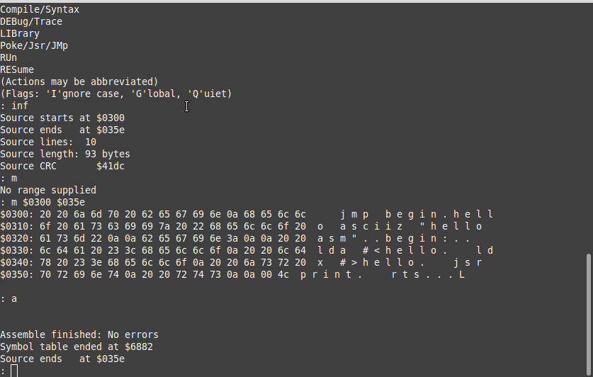
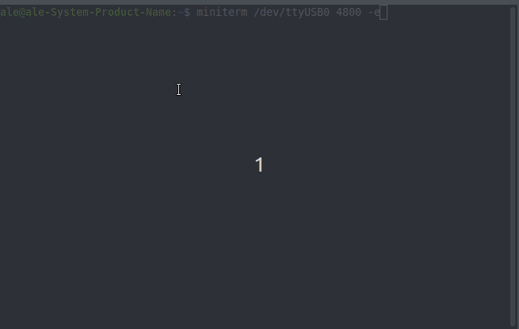
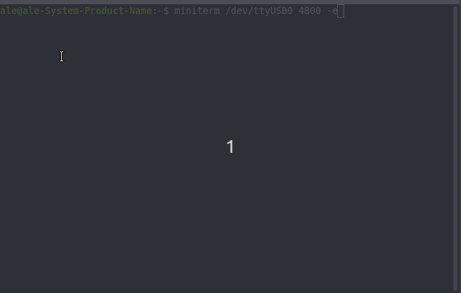
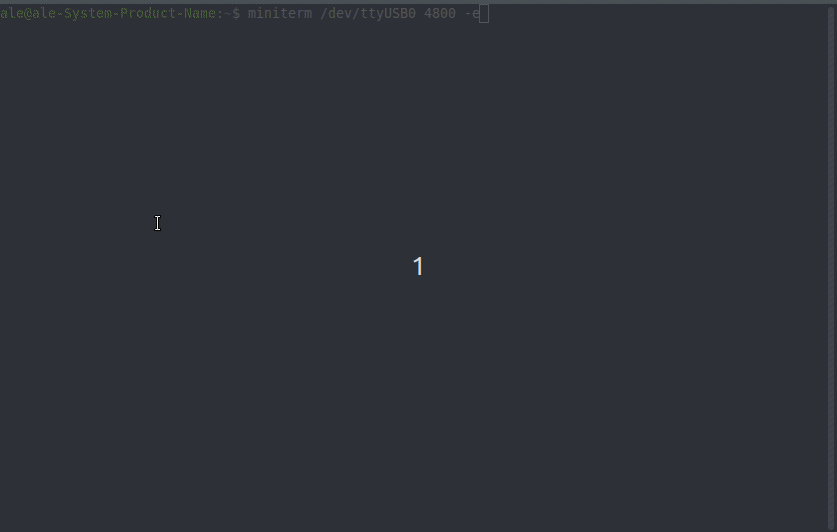

## Some samples programmes (with linux miniterm at 4800 bauds)

```console
miniterm /dev/ttyUSB0 4800 -e
```

- From G-Pascal video demos [G-Pascal](https://vimeo.com/682663375)

- After launching minicom press the green NMI button







- LED test on PA4 active low level







